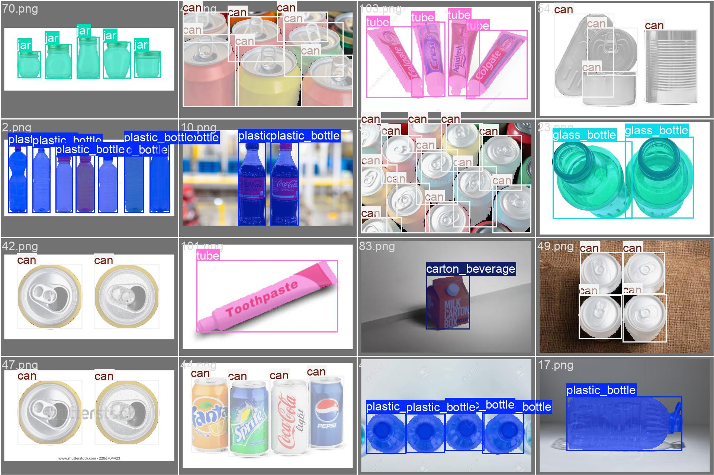

# PackDet
This is a dataset with images of different types of packages such as plastic bottles, glass bottles, cans, tubes, jars and cartons.
The training and validation images are in the train and val folders respectively.
The polygon annotations specifying the exact boundaries of packages are in the related labels folders.

## Goal
This dataset is collected to train a YOLO model to detect and count different types of packages in a production line.
A model is trained on this dataset to detect and segment packages in images. 

## Sample Images
As an example, the following image is from the dataset. The image is annotated with polygons around the packages.

    

## How to Use
In order to use the dataset for training purposes, one can download the dataset at first and then change the `path`
in the `data.yaml` file to the absolute path where the data is stored. The `data.yaml` file is in the `data` folder.

## License
This dataset is licensed under the Attribution–NonCommercial 4.0 International License (CC BY-NC 4.0).